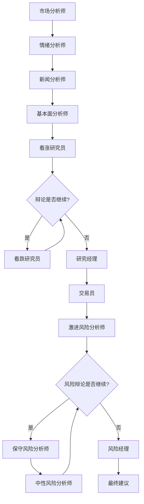

# TradingAgents-MCPmode

基于MCP工具的多智能体交易分析系统

## 🌟 项目概述

**TradingAgents-MCPmode** 是一个创新的多智能体交易分析系统，集成了 Model Context Protocol (MCP) 工具，实现了智能化的股票分析和交易决策流程。系统通过多个专业化智能体的协作，提供全面的市场分析、投资建议和风险管理。

### 🎯 核心特性

- **🤖 多智能体协作**: 12个专业化智能体分工合作
- **🔧 MCP工具集成**: 支持外部数据源和实时信息获取
- **📊 全面分析**: 市场、情绪、新闻、基本面四维度分析
- **💭 智能辩论**: 看涨/看跌研究员辩论机制
- **⚠️ 风险管理**: 三层风险分析和管理决策
- **🎛️ 灵活配置**: 通过环境变量控制智能体MCP权限
- **🌍 多市场支持**: 美股(US)、A股(CN)、港股(HK)
- **📈 实时决策**: 基于最新数据的交易建议

## 🏗️ 系统架构

### 智能体组织结构

```
┌─────────────────────────────────────────────────────────────┐
│                    TradingAgents-MCPmode                   │
├─────────────────────────────────────────────────────────────┤
│  📊 分析师团队 (Analysts)                                    │
│  ├── MarketAnalyst      (市场分析师)                        │
│  ├── SentimentAnalyst   (情绪分析师)                        │
│  ├── NewsAnalyst        (新闻分析师)                        │
│  └── FundamentalsAnalyst(基本面分析师)                      │
├─────────────────────────────────────────────────────────────┤
│  🔬 研究员团队 (Researchers)                                │
│  ├── BullResearcher     (看涨研究员)                        │
│  └── BearResearcher     (看跌研究员)                        │
├─────────────────────────────────────────────────────────────┤
│  👔 管理层 (Managers)                                       │
│  ├── ResearchManager    (研究经理)                          │
│  └── Trader             (交易员)                            │
├─────────────────────────────────────────────────────────────┤
│  ⚠️ 风险管理团队 (Risk Management)                          │
│  ├── AggressiveRiskAnalyst (激进风险分析师)                 │
│  ├── SafeRiskAnalyst       (保守风险分析师)                 │
│  ├── NeutralRiskAnalyst    (中性风险分析师)                 │
│  └── RiskManager           (风险经理)                       │
└─────────────────────────────────────────────────────────────┘
```

### 工作流程



## 🚀 快速开始

### 1. 环境准备

```bash
# 克隆项目
git clone <repository-url>
cd TradingAgents-MCPmode

# 创建虚拟环境
python -m venv venv

# 激活虚拟环境
# Windows:
venv\Scripts\activate
# macOS/Linux:
# source venv/bin/activate

# 安装依赖
pip install -r requirements.txt
```

### 2. 配置设置

#### 环境变量配置 (`.env`)

```bash
# 大模型API配置
LLM_API_KEY=your_api_key_here
LLM_BASE_URL=your_llm_base_url
LLM_MODEL=your_llm_model
LLM_TEMPERATURE=0.3
LLM_MAX_TOKENS=4000

# 智能体MCP权限控制
MARKET_ANALYST_MCP_ENABLED=true
SENTIMENT_ANALYST_MCP_ENABLED=true
NEWS_ANALYST_MCP_ENABLED=true
FUNDAMENTALS_ANALYST_MCP_ENABLED=true
BULL_RESEARCHER_MCP_ENABLED=false
BEAR_RESEARCHER_MCP_ENABLED=false
RESEARCH_MANAGER_MCP_ENABLED=false
TRADER_MCP_ENABLED=true
AGGRESSIVE_RISK_ANALYST_MCP_ENABLED=false
SAFE_RISK_ANALYST_MCP_ENABLED=false
NEUTRAL_RISK_ANALYST_MCP_ENABLED=false
RISK_MANAGER_MCP_ENABLED=true

# 工作流配置
MAX_DEBATE_ROUNDS=3
MAX_RISK_DEBATE_ROUNDS=2
DEBUG_MODE=true
VERBOSE_LOGGING=true

# 股票分析配置
DEFAULT_COMPANY=AAPL
STOCK_MARKET_TYPE=US
```

#### MCP服务器配置 (`mcp_config.json`)

```json
{
  "servers": {
    "finance-data-server": {
      "url": "http://106.14.205.176:3101/sse",
      "transport": "sse",
      "timeout": 600
    }
  }
}
```

> **注意**: MCP权限配置已完全移至环境变量 (`.env`) 中，不再在此文件中配置。

### 3. 运行系统

#### 交互模式

```bash
python main.py
```

#### 单次分析模式

```bash
# 分析苹果股票
python main.py -q AAPL

# 指定日期和市场
python main.py -q AAPL -d 2024-01-15 -m US

# 分析A股
python main.py -q "平安银行" -m CN
```

#### 调试模式

```bash
# 启用调试并保存日志
python main.py --debug --log-file analysis.log
```

## 📋 使用示例

### 交互模式示例

```
╔══════════════════════════════════════════════════════════════╗
║                    TradingAgents-MCPmode                    ║
║                基于MCP工具的多智能体交易分析系统                ║
║                                                              ║
║  🤖 多智能体协作  📊 实时数据分析  🔧 MCP工具集成  📈 交易决策   ║
╚══════════════════════════════════════════════════════════════╝

🤖 智能体总数: 12
🔧 MCP工具总数: 5
✅ 启用MCP的智能体: 6
📋 启用列表: market_analyst, sentiment_analyst, news_analyst, fundamentals_analyst, trader, risk_manager

============================================================
🚀 交互模式已启动
💡 输入 'quit' 或 'exit' 退出程序
💡 输入 'help' 查看帮助信息
============================================================

----------------------------------------
📈 请输入股票代码或公司名称 (或 'quit' 退出): AAPL
📅 请输入交易日期 (YYYY-MM-DD, 默认今天): 2024-01-15
🌍 请输入市场类型 (US/CN/HK, 默认US): US

🔄 开始分析 AAPL (US) - 2024-01-15...
```

### 分析结果示例

```
================================================================================
📊 交易分析结果
================================================================================
🏢 分析股票: AAPL
📅 交易日期: 2024-01-15
🌍 股票市场: US
⏰分析时间: 2024-01-15 14:30:25

---------------------------------------- 分析报告 ----------------------------------------

📈 市场分析报告:
苹果公司(AAPL)当前股价为$185.64，较前一交易日上涨1.2%。技术指标显示...

😊 情绪分析报告:
基于社交媒体和新闻情绪分析，投资者对苹果股票整体情绪偏向乐观...

📰 新闻分析报告:
最新消息显示苹果公司将在下季度发布新产品线，市场预期积极...

📊 基本面分析报告:
P/E比率为28.5，略高于行业平均水平。营收增长稳定，现金流充裕...

---------------------------------------- 投资决策 ----------------------------------------

💡 投资计划:
基于综合分析，建议采取适度看涨策略，目标价位$195...

💰 交易决策:
建议分批买入，初始仓位15%，止损位$180，止盈位$195...

---------------------------------------- 风险管理 ----------------------------------------

⚠️ 风险评估:
主要风险包括市场波动、技术股整体调整风险。建议控制仓位...

🎯 最终建议:
综合评估后，给予AAPL "买入"评级，目标价$195，投资期限3-6个月...

---------------------------------------- 执行统计 ----------------------------------------

📊 执行统计:
  • 智能体执行次数: 12
  • MCP工具调用次数: 8
  • 启用MCP的智能体: 6/12
  • 投资辩论轮次: 3
  • 风险辩论轮次: 2

================================================================================
```

## ⚙️ 配置说明

### 智能体MCP权限控制

**所有MCP权限配置均通过环境变量 (`.env`) 控制**，通过 `*_MCP_ENABLED` 变量控制每个智能体是否可以使用MCP工具：

- `true`: 智能体可以调用MCP工具获取实时数据
- `false`: 智能体仅使用预训练知识，不调用外部工具

> **重要**: 不再支持在 `mcp_config.json` 中配置智能体权限，所有权限配置必须在 `.env` 文件中设置。

### 支持的大模型

系统支持任何OpenAI兼容的API：

- **OpenAI**: `https://api.openai.com/v1`
- **智谱GLM**: `https://open.bigmodel.cn/api/paas/v4/`
- **通义千问**: `https://dashscope.aliyuncs.com/compatible-mode/v1`
- **月之暗面**: `https://api.moonshot.cn/v1`
- **DeepSeek**: `https://api.deepseek.com/v1`

### 工作流参数

- `MAX_DEBATE_ROUNDS`: 投资辩论最大轮次
- `MAX_RISK_DEBATE_ROUNDS`: 风险辩论最大轮次
- `DEBUG_MODE`: 调试模式开关
- `VERBOSE_LOGGING`: 详细日志开关

## 🔧 开发指南

### 项目结构

```
TradingAgents-MCPmode/
├── main.py                 # 主程序入口
├── requirements.txt        # 依赖包列表
├── .env                   # 环境变量配置
├── mcp_config.json        # MCP服务器配置
├── README.md              # 项目说明
├── workflow.txt           # 工作流设计文档
└── src/                   # 源代码目录
    ├── __init__.py
    ├── agent_states.py     # 智能体状态管理
    ├── mcp_manager.py      # MCP工具管理
    ├── base_agent.py       # 智能体基类
    ├── workflow_orchestrator.py  # 工作流编排器
    └── agents/            # 智能体实现
        ├── __init__.py
        ├── analysts.py     # 分析师智能体
        ├── researchers.py  # 研究员智能体
        ├── managers.py     # 管理层智能体
        └── risk_management.py  # 风险管理智能体
```

### 添加新智能体

1. 继承 `BaseAgent` 类
2. 实现 `get_system_prompt()` 方法
3. 实现 `process()` 方法
4. 在 `WorkflowOrchestrator` 中注册
5. 在 `.env` 中添加MCP权限配置

### 添加新MCP工具

1. 在 `mcp_config.json` 中配置服务器
2. 工具会自动被发现和注册
3. 智能体可根据权限配置使用工具

## 🐛 故障排除

### 常见问题

1. **MCP连接失败**
   - 检查 `mcp_config.json` 中的服务器URL
   - 确认网络连接正常
   - 检查服务器是否运行

2. **大模型API调用失败**
   - 验证API密钥是否正确
   - 检查base_url格式
   - 确认模型名称正确

3. **智能体无法使用MCP工具**
   - 检查 `.env` 中的权限配置
   - 确认MCP服务器连接正常
   - 查看日志中的错误信息

### 调试方法

```bash
# 启用详细日志
python main.py --debug --log-file debug.log

# 检查配置
python -c "from src.workflow_orchestrator import WorkflowOrchestrator; import asyncio; async def test(): o = WorkflowOrchestrator(); await o.initialize(); print(o.get_workflow_info()); asyncio.run(test())"
```

## 📄 许可证

本项目采用 MIT 许可证。详见 [LICENSE](LICENSE) 文件。

## 🤝 贡献

欢迎提交 Issue 和 Pull Request！

## 📞 联系方式

如有问题或建议，请通过以下方式联系：

- 提交 GitHub Issue
- 发送邮件至项目维护者

---

**TradingAgents-MCPmode** - 让AI智能体为您的投资决策保驾护航！ 🚀📈