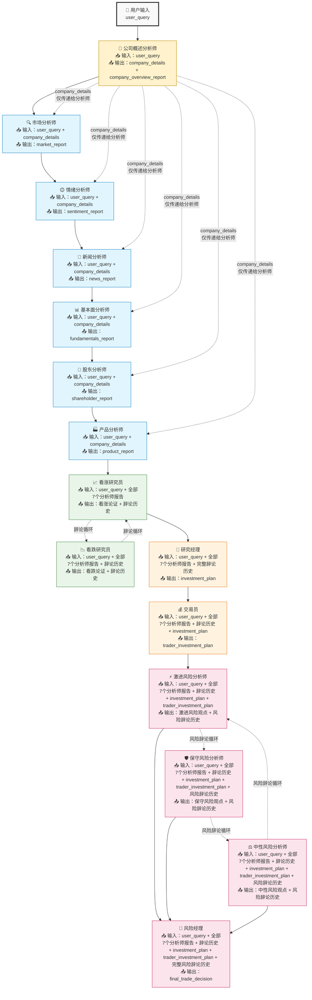

# TradingAgents-MCPmode

基于MCP工具的多智能体交易分析系统

## 🌟 项目概述

**TradingAgents-MCPmode** 是一个创新的多智能体交易分析系统，集成了 Model Context Protocol (MCP) 工具，实现了智能化的股票分析和交易决策流程。系统通过多个专业化智能体的协作，提供全面的市场分析、投资建议和风险管理。

### 🎯 核心特性

- **🤖 多智能体协作**: 15个专业化智能体分工合作
- **🔧 MCP工具集成**: 支持外部数据源和实时信息获取
- **📊 全面分析**: 公司概述、市场、情绪、新闻、基本面、股东结构、产品业务七维度分析
- **💭 智能辩论**: 看涨/看跌研究员辩论机制
- **⚠️ 风险管理**: 三层风险分析和管理决策
- **🎛️ 灵活配置**: 通过环境变量控制智能体MCP权限
- **🌍 多市场支持**: 美股(US)、A股(CN)、港股(HK)
- **🗣️ 自然语言**: 支持自然语言查询，无需指定市场和日期
- **📈 实时决策**: 基于最新数据的交易建议
- **📄 多格式报告**: 支持Markdown、PDF、DOCX等多种格式导出

## 🏗️ 系统架构

### 智能体组织结构

```
┌─────────────────────────────────────────────────────────────┐
│                    TradingAgents-MCPmode                   │
├─────────────────────────────────────────────────────────────┤
│  📊 分析师团队 (Analysts)                                    │
│  ├── CompanyOverviewAnalyst (公司概述分析师)               │
│  ├── MarketAnalyst      (市场分析师)                        │
│  ├── SentimentAnalyst   (情绪分析师)                        │
│  ├── NewsAnalyst        (新闻分析师)                        │
│  ├── FundamentalsAnalyst(基本面分析师)                      │
│  ├── ShareholderAnalyst (股东分析师)                        │
│  └── ProductAnalyst     (产品分析师)                        │
├─────────────────────────────────────────────────────────────┤
│  🔬 研究员团队 (Researchers)                                │
│  ├── BullResearcher     (看涨研究员)                        │
│  └── BearResearcher     (看跌研究员)                        │
├─────────────────────────────────────────────────────────────┤
│  👔 管理层 (Managers)                                       │
│  ├── ResearchManager    (研究经理)                          │
│  └── Trader             (交易员)                            │
├─────────────────────────────────────────────────────────────┤
│  ⚠️ 风险管理团队 (Risk Management)                          │
│  ├── AggressiveRiskAnalyst (激进风险分析师)                 │
│  ├── SafeRiskAnalyst       (保守风险分析师)                 │
│  ├── NeutralRiskAnalyst    (中性风险分析师)                 │
│  └── RiskManager           (风险经理)                       │
└─────────────────────────────────────────────────────────────┘
```

### 工作流程



### 📊 数据流转机制

系统采用智能的信息累积和精准传递机制，确保每个智能体都能获得恰当的上下文信息：

#### 🎯 关键设计特点

1. **company_details占位符系统**
   - 🏢 **公司概述分析师**首先获取公司基础信息
   - 📥 **仅传递给分析师团队**：6个专业分析师都能获得准确的公司背景
   - 🚫 **不传递给后续智能体**：研究员及之后的智能体专注于分析报告综合评估

2. **信息累积效应**
   - **第0阶段**：仅用户查询
   - **第1阶段**：用户查询 + 公司详细信息
   - **第2阶段**：用户查询 + 全部7个分析师报告
   - **第3阶段**：用户查询 + 分析师报告 + 辩论历史 + 投资决策
   - **第4阶段**：用户查询 + 所有信息 + 风险观点

3. **双重辩论机制**
   - **投资辩论**：看涨 ↔ 看跌研究员循环辩论
   - **风险辩论**：激进 ↔ 保守 ↔ 中性风险分析师循环辩论

#### 📋 各阶段输入输出详情

| 智能体 | 输入信息 | 输出信息 | 特殊说明 |
|--------|----------|----------|----------|
| 🏢 公司概述分析师 | user_query | company_details + company_overview_report | 信息收集者 |
| 🔍 市场分析师 | user_query + company_details | market_report | 获得公司背景 |
| 😊 情绪分析师 | user_query + company_details | sentiment_report | 获得公司背景 |
| 📰 新闻分析师 | user_query + company_details | news_report | 获得公司背景 |
| 📊 基本面分析师 | user_query + company_details | fundamentals_report | 获得公司背景 |
| 👥 股东分析师 | user_query + company_details | shareholder_report | 获得公司背景 |
| 🏭 产品分析师 | user_query + company_details | product_report | 获得公司背景 |
| 📈 看涨研究员 | user_query + 全部7个分析师报告 | 看涨论证 + 辩论历史 | 综合分析评估 |
| 📉 看跌研究员 | user_query + 全部7个分析师报告 + 辩论历史 | 看跌论证 + 辩论历史 | 综合分析评估 |
| 🎯 研究经理 | user_query + 分析师报告 + 完整辩论历史 | investment_plan | 决策制定者 |
| 💰 交易员 | user_query + 分析师报告 + 辩论历史 + 投资决策 | trader_investment_plan | 执行计划者 |
| ⚡ 激进风险分析师 | 全部信息 | 激进风险观点 + 风险辩论历史 | 风险评估 |
| 🛡️ 保守风险分析师 | 全部信息 + 风险辩论历史 | 保守风险观点 + 风险辩论历史 | 风险评估 |
| ⚖️ 中性风险分析师 | 全部信息 + 风险辩论历史 | 中性风险观点 + 风险辩论历史 | 风险评估 |
| 🎯 风险经理 | 全部信息 + 完整风险辩论历史 | final_trade_decision | 最终决策者 |

#### 💡 实际应用示例

**用户输入**："分析特斯拉股票"

1. **🏢 公司概述分析师**：获取Tesla Inc.、TSLA、NASDAQ、电动汽车行业等基础信息
2. **📰 新闻分析师**：基于准确的"Tesla Inc."公司名称，搜索最新新闻，而不是泛泛的"特斯拉"信息
3. **📊 基本面分析师**：基于Tesla的具体业务特点，重点关注电动汽车相关的财务指标
4. **📈 看涨研究员**：综合所有7个专业分析报告，构建Tesla的看涨投资论证
5. **🎯 风险经理**：基于所有信息和辩论结果，做出Tesla投资的最终风险决策

这种设计确保了**信息的精准传递**和**逐步精炼**，每个智能体都能在最适合的信息环境中发挥专业能力！

## 🚀 快速开始

### 1. 环境准备

```bash
# 克隆项目
git clone <repository-url>
cd TradingAgents-MCPmode

# 创建虚拟环境
python -m venv venv

# 激活虚拟环境
# Windows:
venv\Scripts\activate
# macOS/Linux:
# source venv/bin/activate

# 安装依赖
pip install -r requirements.txt
```

### 2. 配置设置

#### 环境变量配置 (`.env`)

```bash
# 大模型API配置
LLM_API_KEY=your_api_key_here
LLM_BASE_URL=your_llm_base_url
LLM_MODEL=your_llm_model
LLM_TEMPERATURE=0.3
LLM_MAX_TOKENS=4000

# 智能体MCP权限控制
COMPANY_OVERVIEW_ANALYST_MCP_ENABLED=true
MARKET_ANALYST_MCP_ENABLED=true
SENTIMENT_ANALYST_MCP_ENABLED=true
NEWS_ANALYST_MCP_ENABLED=true
FUNDAMENTALS_ANALYST_MCP_ENABLED=true
SHAREHOLDER_ANALYST_MCP_ENABLED=true
PRODUCT_ANALYST_MCP_ENABLED=true
BULL_RESEARCHER_MCP_ENABLED=false
BEAR_RESEARCHER_MCP_ENABLED=false
RESEARCH_MANAGER_MCP_ENABLED=false
TRADER_MCP_ENABLED=true
AGGRESSIVE_RISK_ANALYST_MCP_ENABLED=false
SAFE_RISK_ANALYST_MCP_ENABLED=false
NEUTRAL_RISK_ANALYST_MCP_ENABLED=false
RISK_MANAGER_MCP_ENABLED=true

# 工作流配置
MAX_DEBATE_ROUNDS=3
MAX_RISK_DEBATE_ROUNDS=2
DEBUG_MODE=true
VERBOSE_LOGGING=true

```

#### MCP服务器配置 (`mcp_config.json`)

```json
{
  "servers": {
    "finance-data-server": {
      "url": "http://106.14.205.176:3101/sse",
      "transport": "sse",
      "timeout": 600
    }
  }
}
```

> **注意**: MCP权限配置已完全移至环境变量 (`.env`) 中，不再在此文件中配置。

### 3. 运行系统

#### 交互模式

```bash
python main.py
```

## 📊 报告导出功能

系统提供了强大的报告导出功能，支持将JSON分析数据转换为多种格式的美观报告。采用JSON→Markdown→PDF/DOCX的统一转换流程，确保内容完整性和格式美观。

### 🎨 支持的导出格式

1. **Markdown (*.md)** - 轻量级标记语言格式
   - 总是可用，无需额外依赖
   - 支持标题、列表、表格、代码块等
   - 表情符号完美显示

2. **PDF (*.pdf)** - 便携文档格式
   - 专业排版，适合打印和分享
   - 中文字体支持（微软雅黑）
   - 表情符号使用 Segoe UI Emoji 字体
   - A4页面，自动分页

3. **DOCX (*.docx)** - Microsoft Word文档
   - 完全兼容 Microsoft Word
   - 丰富的字体和样式支持
   - 表情符号原生支持
   - 标准Word格式

### 🚀 使用方法

#### 🎯 推荐使用流程

```bash
# 第一步：进入导出工具目录
cd src/dumptools

# 第二步：JSON转换为Markdown（必需）
python json_to_markdown.py -d "../dump" --latest

# 第三步：Markdown转换为目标格式
python md2pdf.py -l -d "../dump"     # 生成PDF
python md2docx.py -l -d "../dump"    # 生成DOCX
```

#### 📋 命令行参数说明

**JSON to Markdown 转换器 (`json_to_markdown.py`)：**
```bash
# 转换最新的JSON文件
python json_to_markdown.py -d "../dump" --latest

# 转换所有JSON文件
python json_to_markdown.py -d "../dump" --all

# 列出所有可用的JSON文件
python json_to_markdown.py -d "../dump" --list

# 转换指定文件
python json_to_markdown.py -d "../dump" --file ../dump/session_20250805_132307.json
```

**Markdown to PDF 转换器 (`md2pdf.py`)：**
```bash
# 转换最新的JSON文件（自动调用Markdown转换）
python md2pdf.py -l -d "../dump"

# 批量转换所有JSON文件
python md2pdf.py -a -d "../dump"

# 转换指定JSON文件
python md2pdf.py -f "../dump/session_20250805_132307.json" -d "../dump"
```

**Markdown to DOCX 转换器 (`md2docx.py`)：**
```bash
# 转换最新的JSON文件（自动调用Markdown转换）
python md2docx.py -l -d "../dump"

# 批量转换所有JSON文件
python md2docx.py -a -d "../dump"

# 转换指定JSON文件
python md2docx.py -f "../dump/session_20250805_132307.json" -d "../dump"
```

#### 💡 快速转换示例

**转换最新分析报告：**
```bash
cd src/dumptools
python json_to_markdown.py -d "../dump" --latest
python md2pdf.py -l -d "../dump"
python md2docx.py -l -d "../dump"
```

**批量转换所有报告：**
```bash
cd src/dumptools
python json_to_markdown.py -d "../dump" --all
python md2pdf.py -a -d "../dump"
python md2docx.py -a -d "../dump"
```

### 📁 输出目录结构

导出的文件会保存在对应的目录中：

```
TradingAgents-MCPmode/
└── src/
    └── dumptools/
        ├── markdown_reports/          # Markdown报告目录
        │   ├── session_20250805_132307.md
        │   └── session_20250805_150001.md
        ├── pdf_reports/              # PDF报告目录
        │   ├── session_20250805_132307.pdf
        │   └── session_20250805_150001.pdf
        └── docx_reports/             # DOCX报告目录
            ├── session_20250805_132307.docx
            └── session_20250805_150001.docx
```

### 🔄 转换流程架构

系统采用三步转换流程，确保内容完整性和格式兼容性：

```
第一步：JSON → Markdown
        ↓
第二步：Markdown → PDF
        ↓  
第三步：Markdown → DOCX
```

**流程优势：**
- ✅ **内容完整性**：保证所有分析数据都被正确转换
- ✅ **格式标准化**：基于Markdown统一中间格式
- ✅ **高稳定性**：减少转换错误和数据丢失
- ✅ **模块化设计**：易于维护和扩展

### 🎨 报告样式特性

**📝 Markdown格式：**
- 标准Markdown语法
- 清晰的层级结构
- 支持表情符号和特殊字符
- 兼容所有Markdown阅读器

**📄 PDF格式：**
- 字体：中文使用微软雅黑，英文使用Helvetica，代码使用Courier
- 页面：A4大小，72pt页边距
- 样式：标题居中加粗，正文两端对齐
- 表情：Segoe UI Emoji字体支持

**📃 DOCX格式：**
- 字体：中文使用微软雅黑，代码使用Consolas
- 格式：标题居中，段落适中间距
- 兼容：完全兼容Microsoft Word
- 表情：原生表情符号支持

### 🔧 依赖安装

```bash
# 安装所有必需依赖
pip install reportlab python-docx

# 或安装完整项目依赖
pip install -r requirements.txt
```

**依赖说明：**
- `reportlab`：PDF生成库
- `python-docx`：DOCX生成库
- 无需额外依赖即可生成Markdown

### ⚠️ 注意事项

1. **系统要求**：确保系统已安装微软雅黑和Segoe UI Emoji字体
2. **文件权限**：确保对输出目录有写入权限
3. **路径规范**：建议在`src/dumptools`目录下执行命令
4. **编码支持**：所有文件使用UTF-8编码，支持中文和特殊字符

### 🔍 故障排除

**常见问题解决：**

```bash
# 检查依赖是否正确安装
python -c "import reportlab; print('✅ reportlab已安装')"
python -c "import docx; print('✅ python-docx已安装')"

# 测试转换器功能
cd src/dumptools
python json_to_markdown.py --help
python md2pdf.py --help
python md2docx.py --help

# 检查字体支持（Windows）
ls C:/Windows/Fonts/msyh.ttc    # 微软雅黑
ls C:/Windows/Fonts/seguiemj.ttf # Segoe UI Emoji
```

**如果转换失败：**
1. 确认JSON文件存在且格式正确
2. 检查文件权限和目录访问权限
3. 确认所有依赖包已正确安装
4. 查看命令行错误输出以定位具体问题

## 🌐 Web前端界面

### 🚀 启动Web前端

项目提供了基于Streamlit的现代化Web界面，支持在线配置和实时监控分析过程。

```bash
# 启动Web前端
streamlit run web_app.py
```

启动后在浏览器中访问: `http://localhost:8501`

### 📋 页面功能

#### 🏠 首页
- 系统概览和统计信息
- 工作流程图和阶段说明
- 快速导航到其他功能页面

#### ⚙️ 系统配置
- **🤖 大模型配置**: 在线修改API密钥、Base URL、模型参数等
- **🔧 智能体权限**: 可视化配置各智能体的MCP工具使用权限
- **🌐 MCP服务器**: 管理MCP服务器连接配置
- 支持实时保存配置到`.env`和`mcp_config.json`文件

#### 📊 实时分析
- 输入自然语言查询开始分析
- 实时显示分析进度和当前执行阶段
- 可视化智能体执行状态
- 支持中途停止分析

#### 📈 智能体结果页面
- **📊 分析师团队**: 7个分析师的详细报告，每个分析师单独标签页
- **💭 看涨看跌辩论**: 投资观点辩论过程和历史记录
- **👔 研究经理**: 投资决策制定报告
- **💰 交易员**: 交易执行计划
- **⚠️ 风险辩论**: 风险评估辩论过程
- **🎯 风险经理**: 最终交易决策

#### 📋 历史报告
- 查看所有历史分析会话
- 按时间排序的会话列表
- 详细的执行统计和错误信息
- 支持导出为Markdown、PDF、DOCX格式

### 🎯 核心特性

1. **实时监控**: 可视化显示15个智能体的执行进度和状态
2. **配置管理**: 无需手动编辑配置文件，Web界面直接修改
3. **结果展示**: 按智能体类型分组展示，便于理解工作流
4. **历史管理**: 完整的会话历史和结果导出功能
5. **响应式设计**: 适配不同屏幕尺寸，支持移动端访问

### 💡 使用技巧

- 首次使用建议先在"系统配置"页面检查并配置LLM API参数
- 可以通过智能体权限配置来控制哪些智能体使用MCP工具
- 实时分析页面会自动保存会话到`src/dump/`目录
- 历史报告页面可以重新导出已完成的分析结果

## 🔧 开发指南

### 项目结构

```
TradingAgents-MCPmode/
├── main.py                 # 命令行主程序入口
├── web_app.py              # Web前端主程序入口
├── requirements.txt        # 依赖包列表
├── .env                   # 环境变量配置
├── mcp_config.json        # MCP服务器配置
├── README.md              # 项目说明
├── workflow.txt           # 工作流设计文档
└── src/                   # 源代码目录
    ├── __init__.py
    ├── agent_states.py     # 智能体状态管理
    ├── mcp_manager.py      # MCP工具管理
    ├── base_agent.py       # 智能体基类
    ├── workflow_orchestrator.py  # 工作流编排器
    ├── agents/            # 智能体实现
    │   ├── __init__.py
    │   ├── analysts.py     # 分析师智能体
    │   ├── researchers.py  # 研究员智能体
    │   ├── managers.py     # 管理层智能体
    │   └── risk_management.py  # 风险管理智能体
    ├── web/               # Web前端组件
    │   ├── __init__.py
    │   ├── config_manager.py    # 配置管理器
    │   ├── analysis_monitor.py  # 分析监控器
    │   └── results_viewer.py    # 结果查看器
    └── dumptools/         # 报告导出工具
        ├── __init__.py
        ├── json_to_markdown.py  # Markdown转换器
        ├── md2pdf.py           # Markdown转PDF转换器
        └── md2docx.py          # Markdown转DOCX转换器
```

### 添加新智能体

1. 继承 `BaseAgent` 类
2. 实现 `get_system_prompt()` 方法
3. 实现 `process()` 方法
4. 在 `WorkflowOrchestrator` 中注册
5. 在 `.env` 中添加MCP权限配置

### 添加新MCP工具

1. 在 `mcp_config.json` 中配置服务器
2. 工具会自动被发现和注册
3. 智能体可根据权限配置使用工具

### 添加新报告格式

1. 在 `src/dumptools/` 目录下创建新的转换器文件
2. 实现转换逻辑，参考现有转换器的接口：
   - 继承或参考现有转换器的结构
   - 实现 `convert_markdown_to_[format]()` 方法
   - 实现 `convert_latest_json()` 方法
   - 实现 `convert_all_json()` 方法
3. 在 `src/dumptools/__init__.py` 中导入新转换器
4. 更新README文档中的格式说明

## 🐛 故障排除

### 常见问题

1. **MCP连接失败**
   - 检查 `mcp_config.json` 中的服务器URL
   - 确认网络连接正常
   - 检查服务器是否运行

2. **大模型API调用失败**
   - 验证API密钥是否正确
   - 检查base_url格式
   - 确认模型名称正确

3. **智能体无法使用MCP工具**
   - 检查 `.env` 中的权限配置
   - 确认MCP服务器连接正常
   - 查看日志中的错误信息

4. **报告导出失败**
   - 检查 `reports/` 目录是否存在写入权限
   - 确认所需的Python包已安装 (reportlab, python-docx等)
   - 查看具体的错误信息，可能是字体或编码问题
   - PDF导出失败时，检查是否有特殊字符或格式问题

### 调试方法

```bash
# 启用详细日志
python main.py --debug --log-file debug.log

# 检查配置
python -c "from src.workflow_orchestrator import WorkflowOrchestrator; import asyncio; async def test(): o = WorkflowOrchestrator(); await o.initialize(); print(o.get_workflow_info()); asyncio.run(test())"
```

## 📄 许可证

本项目采用 MIT 许可证。详见 [LICENSE](LICENSE) 文件。

## 🤝 贡献

欢迎提交 Issue 和 Pull Request！

## 📞 联系方式

如有问题或建议，请通过以下方式联系：

- 提交 GitHub Issue
- 发送邮件至项目维护者

---

**TradingAgents-MCPmode** - 让AI智能体为您的投资决策保驾护航！ 🚀📈