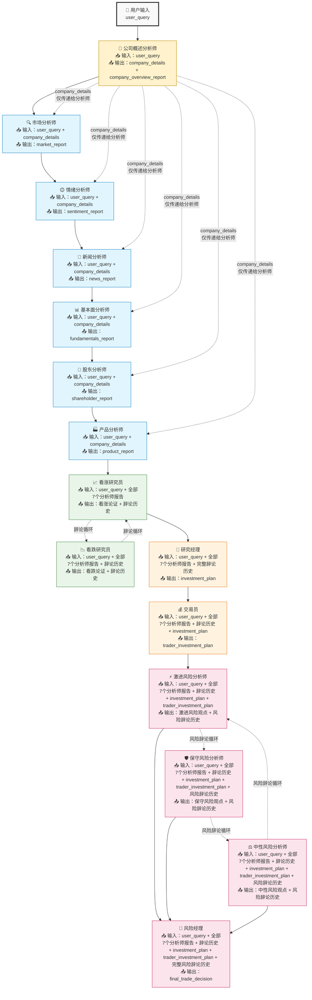

# TradingAgents-MCPmode

基于MCP工具的多智能体交易分析系统

## 🌟 项目概述

**TradingAgents-MCPmode** 是一个创新的多智能体交易分析系统，集成了 Model Context Protocol (MCP) 工具，实现了智能化的股票分析和交易决策流程。系统通过多个专业化智能体的协作，提供全面的市场分析、投资建议和风险管理。

### 🎯 核心特性

- **🤖 多智能体协作**: 15个专业化智能体分工合作
- **🔧 MCP工具集成**: 支持外部数据源和实时信息获取
- **📊 全面分析**: 公司概述、市场、情绪、新闻、基本面、股东结构、产品业务七维度分析
- **💭 智能辩论**: 看涨/看跌研究员辩论机制
- **⚠️ 风险管理**: 三层风险分析和管理决策
- **🎛️ 灵活配置**: 通过环境变量控制智能体MCP权限
- **🌍 多市场支持**: 美股(US)、A股(CN)、港股(HK)
- **🗣️ 自然语言**: 支持自然语言查询，无需指定市场和日期
- **📈 实时决策**: 基于最新数据的交易建议
- **📄 多格式报告**: 支持Markdown、PDF、DOCX等多种格式导出

## 🏗️ 系统架构

### 智能体组织结构

```
┌─────────────────────────────────────────────────────────────┐
│                    TradingAgents-MCPmode                   │
├─────────────────────────────────────────────────────────────┤
│  📊 分析师团队 (Analysts)                                    │
│  ├── CompanyOverviewAnalyst (公司概述分析师)               │
│  ├── MarketAnalyst      (市场分析师)                        │
│  ├── SentimentAnalyst   (情绪分析师)                        │
│  ├── NewsAnalyst        (新闻分析师)                        │
│  ├── FundamentalsAnalyst(基本面分析师)                      │
│  ├── ShareholderAnalyst (股东分析师)                        │
│  └── ProductAnalyst     (产品分析师)                        │
├─────────────────────────────────────────────────────────────┤
│  🔬 研究员团队 (Researchers)                                │
│  ├── BullResearcher     (看涨研究员)                        │
│  └── BearResearcher     (看跌研究员)                        │
├─────────────────────────────────────────────────────────────┤
│  👔 管理层 (Managers)                                       │
│  ├── ResearchManager    (研究经理)                          │
│  └── Trader             (交易员)                            │
├─────────────────────────────────────────────────────────────┤
│  ⚠️ 风险管理团队 (Risk Management)                          │
│  ├── AggressiveRiskAnalyst (激进风险分析师)                 │
│  ├── SafeRiskAnalyst       (保守风险分析师)                 │
│  ├── NeutralRiskAnalyst    (中性风险分析师)                 │
│  └── RiskManager           (风险经理)                       │
└─────────────────────────────────────────────────────────────┘
```

### 工作流程



### 📊 数据流转机制

系统采用智能的信息累积和精准传递机制，确保每个智能体都能获得恰当的上下文信息：

#### 🎯 关键设计特点

1. **company_details占位符系统**
   - 🏢 **公司概述分析师**首先获取公司基础信息
   - 📥 **仅传递给分析师团队**：6个专业分析师都能获得准确的公司背景
   - 🚫 **不传递给后续智能体**：研究员及之后的智能体专注于分析报告综合评估

2. **信息累积效应**
   - **第0阶段**：仅用户查询
   - **第1阶段**：用户查询 + 公司详细信息
   - **第2阶段**：用户查询 + 全部7个分析师报告
   - **第3阶段**：用户查询 + 分析师报告 + 辩论历史 + 投资决策
   - **第4阶段**：用户查询 + 所有信息 + 风险观点

3. **双重辩论机制**
   - **投资辩论**：看涨 ↔ 看跌研究员循环辩论
   - **风险辩论**：激进 ↔ 保守 ↔ 中性风险分析师循环辩论

#### 📋 各阶段输入输出详情

| 智能体 | 输入信息 | 输出信息 | 特殊说明 |
|--------|----------|----------|----------|
| 🏢 公司概述分析师 | user_query | company_details + company_overview_report | 信息收集者 |
| 🔍 市场分析师 | user_query + company_details | market_report | 获得公司背景 |
| 😊 情绪分析师 | user_query + company_details | sentiment_report | 获得公司背景 |
| 📰 新闻分析师 | user_query + company_details | news_report | 获得公司背景 |
| 📊 基本面分析师 | user_query + company_details | fundamentals_report | 获得公司背景 |
| 👥 股东分析师 | user_query + company_details | shareholder_report | 获得公司背景 |
| 🏭 产品分析师 | user_query + company_details | product_report | 获得公司背景 |
| 📈 看涨研究员 | user_query + 全部7个分析师报告 | 看涨论证 + 辩论历史 | 综合分析评估 |
| 📉 看跌研究员 | user_query + 全部7个分析师报告 + 辩论历史 | 看跌论证 + 辩论历史 | 综合分析评估 |
| 🎯 研究经理 | user_query + 分析师报告 + 完整辩论历史 | investment_plan | 决策制定者 |
| 💰 交易员 | user_query + 分析师报告 + 辩论历史 + 投资决策 | trader_investment_plan | 执行计划者 |
| ⚡ 激进风险分析师 | 全部信息 | 激进风险观点 + 风险辩论历史 | 风险评估 |
| 🛡️ 保守风险分析师 | 全部信息 + 风险辩论历史 | 保守风险观点 + 风险辩论历史 | 风险评估 |
| ⚖️ 中性风险分析师 | 全部信息 + 风险辩论历史 | 中性风险观点 + 风险辩论历史 | 风险评估 |
| 🎯 风险经理 | 全部信息 + 完整风险辩论历史 | final_trade_decision | 最终决策者 |

#### 💡 实际应用示例

**用户输入**："分析特斯拉股票"

1. **🏢 公司概述分析师**：获取Tesla Inc.、TSLA、NASDAQ、电动汽车行业等基础信息
2. **📰 新闻分析师**：基于准确的"Tesla Inc."公司名称，搜索最新新闻，而不是泛泛的"特斯拉"信息
3. **📊 基本面分析师**：基于Tesla的具体业务特点，重点关注电动汽车相关的财务指标
4. **📈 看涨研究员**：综合所有7个专业分析报告，构建Tesla的看涨投资论证
5. **🎯 风险经理**：基于所有信息和辩论结果，做出Tesla投资的最终风险决策

这种设计确保了**信息的精准传递**和**逐步精炼**，每个智能体都能在最适合的信息环境中发挥专业能力！

## 🚀 快速开始

### 1. 环境准备

```bash
# 克隆项目
git clone <repository-url>
cd TradingAgents-MCPmode

# 创建虚拟环境
python -m venv venv

# 激活虚拟环境
# Windows:
venv\Scripts\activate
# macOS/Linux:
# source venv/bin/activate

# 安装依赖
pip install -r requirements.txt
```

### 2. 配置设置

#### 环境变量配置 (`.env`)

```bash
# 大模型API配置
LLM_API_KEY=your_api_key_here
LLM_BASE_URL=your_llm_base_url
LLM_MODEL=your_llm_model
LLM_TEMPERATURE=0.3
LLM_MAX_TOKENS=4000

# 智能体MCP权限控制
COMPANY_OVERVIEW_ANALYST_MCP_ENABLED=true
MARKET_ANALYST_MCP_ENABLED=true
SENTIMENT_ANALYST_MCP_ENABLED=true
NEWS_ANALYST_MCP_ENABLED=true
FUNDAMENTALS_ANALYST_MCP_ENABLED=true
SHAREHOLDER_ANALYST_MCP_ENABLED=true
PRODUCT_ANALYST_MCP_ENABLED=true
BULL_RESEARCHER_MCP_ENABLED=false
BEAR_RESEARCHER_MCP_ENABLED=false
RESEARCH_MANAGER_MCP_ENABLED=false
TRADER_MCP_ENABLED=true
AGGRESSIVE_RISK_ANALYST_MCP_ENABLED=false
SAFE_RISK_ANALYST_MCP_ENABLED=false
NEUTRAL_RISK_ANALYST_MCP_ENABLED=false
RISK_MANAGER_MCP_ENABLED=true

# 工作流配置
MAX_DEBATE_ROUNDS=3
MAX_RISK_DEBATE_ROUNDS=2
DEBUG_MODE=true
VERBOSE_LOGGING=true

```

#### MCP服务器配置 (`mcp_config.json`)

```json
{
  "servers": {
    "finance-data-server": {
      "url": "http://106.14.205.176:3101/sse",
      "transport": "sse",
      "timeout": 600
    }
  }
}
```

> **注意**: MCP权限配置已完全移至环境变量 (`.env`) 中，不再在此文件中配置。

### 3. 运行系统

#### 交互模式

```bash
python main.py
```

#### 单次分析模式

```bash
# 分析苹果股票
python main.py -c AAPL

# 分析苹果股票（自然语言）
python main.py -c "苹果公司股票分析"

# 分析A股
python main.py -c "平安银行"

# 分析港股
python main.py -c "腾讯控股"
```

#### 报告格式选择

系统支持多种报告格式导出：

- **1**: HTML格式 (默认)
- **2**: Word格式 (.docx)
- **3**: Markdown格式 (.md)
- **4**: PDF格式 (.pdf)
- **5**: 全部格式

在交互模式下，系统会提示您选择报告格式。单次分析模式默认生成HTML格式报告。

**注意**: 现在支持自然语言查询，您可以直接输入"苹果公司"、"腾讯控股"等，系统会自动识别股票和市场类型。

#### 调试模式

```bash
# 启用调试并保存日志
python main.py --debug --log-file analysis.log
```

## 📋 使用示例

### 交互模式示例

```
╔══════════════════════════════════════════════════════════════╗
║                    TradingAgents-MCPmode                    ║
║                基于MCP工具的多智能体交易分析系统                ║
║                                                              ║
║  🤖 多智能体协作  📊 实时数据分析  🔧 MCP工具集成  📈 交易决策   ║
╚══════════════════════════════════════════════════════════════╝

🤖 智能体总数: 12
🔧 MCP工具总数: 5
✅ 启用MCP的智能体: 6
📋 启用列表: market_analyst, sentiment_analyst, news_analyst, fundamentals_analyst, trader, risk_manager

============================================================
🚀 交互模式已启动
💡 输入 'quit' 或 'exit' 退出程序
💡 输入 'help' 查看帮助信息
============================================================

----------------------------------------
📈 请输入股票代码或公司名称 (或 'quit' 退出): AAPL

📄 请选择报告格式:
1. HTML格式
2. Word格式
3. Markdown格式
4. PDF格式
5. 全部格式
请输入选择 (1-5, 默认1): 4

🔄 开始分析 AAPL...
📄 将生成PDF格式报告...
```

### 分析结果示例

```
================================================================================
📊 交易分析结果
================================================================================
🏢 分析股票: AAPL (苹果公司)
🌍 股票市场: 美股 (NASDAQ)
⏰分析时间: 2024-01-29 14:30:25

---------------------------------------- 分析报告 ----------------------------------------

📈 市场分析报告:
苹果公司(AAPL)当前股价为$185.64，较前一交易日上涨1.2%。技术指标显示...

😊 情绪分析报告:
基于社交媒体和新闻情绪分析，投资者对苹果股票整体情绪偏向乐观...

📰 新闻分析报告:
最新消息显示苹果公司将在下季度发布新产品线，市场预期积极...

📊 基本面分析报告:
P/E比率为28.5，略高于行业平均水平。营收增长稳定，现金流充裕...

---------------------------------------- 投资决策 ----------------------------------------

💡 投资计划:
基于综合分析，建议采取适度看涨策略，目标价位$195...

💰 交易决策:
建议分批买入，初始仓位15%，止损位$180，止盈位$195...

---------------------------------------- 风险管理 ----------------------------------------

⚠️ 风险评估:
主要风险包括市场波动、技术股整体调整风险。建议控制仓位...

🎯 最终建议:
综合评估后，给予AAPL "买入"评级，目标价$195，投资期限3-6个月...

---------------------------------------- 执行统计 ----------------------------------------

📊 执行统计:
  • 智能体执行次数: 12
  • MCP工具调用次数: 8
  • 启用MCP的智能体: 6/12
  • 投资辩论轮次: 3
  • 风险辩论轮次: 2

---------------------------------------- 报告导出 ----------------------------------------

📄 报告已成功导出:
  • PDF报告: reports/AAPL_analysis_report_20240129_143218.pdf
  • 报告大小: 2.3 MB
  • 包含图表: 5个
  • 导出时间: 2024-01-29 14:32:18

================================================================================
```

## ⚙️ 配置说明

### 智能体MCP权限控制

**所有MCP权限配置均通过环境变量 (`.env`) 控制**，通过 `*_MCP_ENABLED` 变量控制每个智能体是否可以使用MCP工具：

- `true`: 智能体可以调用MCP工具获取实时数据
- `false`: 智能体仅使用预训练知识，不调用外部工具

> **重要**: 不再支持在 `mcp_config.json` 中配置智能体权限，所有权限配置必须在 `.env` 文件中设置。

### 支持的大模型

系统支持任何OpenAI兼容的API：

- **OpenAI**: `https://api.openai.com/v1`
- **智谱GLM**: `https://open.bigmodel.cn/api/paas/v4/`
- **通义千问**: `https://dashscope.aliyuncs.com/compatible-mode/v1`
- **月之暗面**: `https://api.moonshot.cn/v1`
- **DeepSeek**: `https://api.deepseek.com/v1`

### 工作流参数

- `MAX_DEBATE_ROUNDS`: 投资辩论最大轮次
- `MAX_RISK_DEBATE_ROUNDS`: 风险辩论最大轮次
- `DEBUG_MODE`: 调试模式开关
- `VERBOSE_LOGGING`: 详细日志开关

## 📊 报告导出功能

系统提供了强大的报告导出功能，支持将JSON分析数据转换为多种格式的美观报告。

### 🎨 支持的导出格式

1. **Markdown (*.md)** - 轻量级标记语言格式
   - 总是可用，无需额外依赖
   - 支持代码块、表格、链接等
   - 表情符号正常显示

2. **PDF (*.pdf)** - 便携文档格式
   - 需要安装: `pip install reportlab markdown2`
   - 专业排版，适合打印和分享
   - 中文字体支持（微软雅黑）
   - 表情符号使用 Segoe UI Emoji 字体

3. **DOCX (*.docx)** - Microsoft Word文档
   - 需要安装: `pip install python-docx`
   - 完全兼容 Microsoft Word
   - 支持字体、样式、格式
   - 表情符号使用 Segoe UI Emoji 字体

### 🚀 使用导出工具

#### 推荐的导出流程

```bash
# 第一步：转换为Markdown格式
python -m src.dumptools.json_to_markdown --latest

# 第二步：从Markdown转换为PDF
python -m src.dumptools.md2pdf -l -d "src/dump"

# 第二步：从Markdown转换为DOCX
python -m src.dumptools.md2docx -l -d "src/dump"

# 一次性转换所有文件
python -m src.dumptools.md2pdf -a -d "src/dump"
python -m src.dumptools.md2docx -a -d "src/dump"
```

<details>
<summary><strong>🔧 单独使用各转换器</strong></summary>

**推荐方法（Windows兼容）**：
```bash
# 进入dumptools目录
cd src/dumptools

# Markdown转换器
python json_to_markdown.py -d "../dump" --latest
python json_to_markdown.py -d "../dump" --all
python json_to_markdown.py -d "../dump" --list


# 通过Markdown中间步骤转换（推荐，内容完整性更好）
python md2pdf.py -l -d "../dump"   # JSON→Markdown→PDF
python md2pdf.py -a -d "../dump"   # 批量转换所有文件

python md2docx.py -l -d "../dump"  # JSON→Markdown→DOCX
python md2docx.py -a -d "../dump"  # 批量转换所有文件

# md2pdf.py支持的Markdown元素：
# - 标题（# ## ###）
# - 粗体文本（**文本**）
# - 引用（> 文本）
# - 列表（- 项目）
# - 代码块（```代码```）
# - 表格（|列1|列2|）
# - Emoji表情符号

# md2docx.py支持的Markdown元素：
# - 标题（# ## ###）
# - 粗体文本（**文本**）
# - 引用（> 文本）
# - 列表（- 项目）
# - 代码块（```代码```）
# - 表格（|列1|列2|）
# - Emoji表情符号（原生支持）
```

**备选方法（需要完整依赖）**：
```bash
# 如果已安装所有依赖，可使用模块方式
python -m src.dumptools.json_to_markdown --latest
python -m src.dumptools.md2pdf -l -d "src/dump"
python -m src.dumptools.md2docx -l -d "src/dump"
```

</details>

### 📁 输出目录结构

导出的文件会保存在对应的目录中：

```
TradingAgents-MCPmode/
└── src/
    └── dumptools/
        ├── markdown_reports/          # Markdown报告目录
        │   ├── session_20250730_104218.md
        │   └── session_20250730_112128.md
        ├── pdf_reports/              # PDF报告目录
        │   ├── session_20250730_104218.pdf
        │   └── session_20250730_112128.pdf
        └── docx_reports/             # DOCX报告目录
            ├── session_20250730_104218.docx
            └── session_20250730_112128.docx
```

### 🔄 导出流程架构

系统采用灵活的导出架构，针对不同格式优化生成流程：

#### Markdown导出
```
JSON数据 → Markdown格式
```

#### PDF导出
```
JSON数据 → Markdown → PDF（推荐）
```

#### DOCX导出
```
JSON数据 → Markdown → DOCX（推荐）
```

#### 流程说明
1. **Markdown转换**：解析JSON数据结构，生成结构化Markdown文档
2. **PDF转换**：先转为Markdown，再使用md2pdf.py转换，确保内容完整性
3. **DOCX转换**：先转为Markdown，再使用md2docx.py转换，确保内容完整性

#### 转换方式优势

**Markdown→PDF/DOCX转换方式**：
- ✅ 内容完整性最佳，不会截断长内容
- ✅ 基于成熟的Markdown格式，稳定性更好
- ✅ 支持完整的分析报告内容
- ✅ 模块化设计，易于维护

#### 优势
- **内容完整**：确保所有分析内容都被保留
- **格式优化**：每种格式都有专门优化的样式和布局
- **稳定性**：减少依赖链，提高转换成功率
- **扩展性**：模块化设计，易于添加新格式
- **质量保证**：每种格式都有独立的内容验证和格式化标准

### 🎨 报告样式特性

<details>
<summary><strong>📝 Markdown格式</strong></summary>

- 使用标准Markdown语法
- 支持表情符号
- 代码块高亮
- 清晰的层级结构

</details>

<details>
<summary><strong>📄 PDF格式</strong></summary>

**字体配置**:
- 中文内容：微软雅黑 (Microsoft YaHei)
- 英文内容：Helvetica
- 代码内容：Courier
- 表情符号：Segoe UI Emoji

**页面设置**:
- 页面大小：A4
- 页边距：72pt
- 自动分页

**样式层级**:
- 标题：20pt，居中，加粗
- 一级标题：16pt，加粗
- 二级标题：14pt，加粗
- 正文：11pt，两端对齐
- 代码：9pt，等宽字体

</details>

<details>
<summary><strong>📃 DOCX格式</strong></summary>

**字体配置**:
- 中文内容：微软雅黑 (Microsoft YaHei)
- 代码内容：Consolas
- 表情符号：Segoe UI Emoji

**格式特性**:
- 标题居中，加粗
- 段落间距适中
- 代码块缩进
- 完全兼容Microsoft Word

</details>

### 🔧 依赖安装

<details>
<summary><strong>📦 一键安装（推荐）</strong></summary>

```bash
# 安装所有项目依赖（包括导出工具）
pip install -r requirements.txt
```

</details>

<details>
<summary><strong>⚙️ 仅安装导出工具依赖</strong></summary>

```bash
# 核心导出依赖（必需）
pip install markdown2 python-docx reportlab

# 可选依赖（如果需要使用统一导出工具）
pip install weasyprint  # 可选，仅统一导出工具需要
```

**依赖说明**：
- **markdown2**: Markdown格式生成（核心依赖）
- **python-docx**: DOCX格式生成（核心依赖）
- **reportlab**: PDF格式生成（核心依赖，已重构为直接生成）
- **weasyprint**: 仅统一导出工具需要，单独使用PDF转换器不需要

**重要更新**：
- ✅ **简化架构**：采用 JSON→Markdown→PDF/DOCX 的统一流程
- ✅ **更好的兼容性**：基于成熟的Markdown格式，稳定性更高
- ✅ **智能字体支持**：自动注册中文字体，支持表情符号显示

</details>

### ⚠️ 注意事项

1. **字体支持**：确保系统已安装微软雅黑和Segoe UI Emoji字体
2. **文件权限**：确保输出目录有写入权限
3. **内容长度**：超长内容会被自动截断以保证文档质量
4. **特殊字符**：表情符号和特殊字符使用专门字体以确保正确显示

### 🔧 故障排除

<details>
<summary><strong>⚠️ 导出工具常见问题</strong></summary>

**问题1：转换器使用**

✅ **推荐流程**：使用 Markdown 作为中间格式的转换方式。

```bash
# 推荐的转换流程
cd src/dumptools
# 第一步：JSON转Markdown
python json_to_markdown.py -d "../dump" --latest
# 第二步：Markdown转PDF/DOCX
python md2pdf.py -l -d "../dump"
python md2docx.py -l -d "../dump"
```

</details>

<details>
<summary><strong>🔍 依赖检查工具</strong></summary>

```bash
# 检查核心导出依赖（必需）
python -c "import markdown2; print('✅ markdown2 - Markdown转换器需要')"
python -c "import docx; print('✅ python-docx - DOCX转换器需要')"
python -c "import reportlab; print('✅ reportlab - PDF转换器需要')"

# 快速测试转换器
cd src/dumptools
python json_to_markdown.py --help
python md2pdf.py --help
python md2docx.py --help
```

</details>

## 🔧 开发指南

### 项目结构

```
TradingAgents-MCPmode/
├── main.py                 # 主程序入口
├── requirements.txt        # 依赖包列表
├── .env                   # 环境变量配置
├── mcp_config.json        # MCP服务器配置
├── README.md              # 项目说明
├── workflow.txt           # 工作流设计文档
└── src/                   # 源代码目录
    ├── __init__.py
    ├── agent_states.py     # 智能体状态管理
    ├── mcp_manager.py      # MCP工具管理
    ├── base_agent.py       # 智能体基类
    ├── workflow_orchestrator.py  # 工作流编排器
    ├── agents/            # 智能体实现
    │   ├── __init__.py
    │   ├── analysts.py     # 分析师智能体
    │   ├── researchers.py  # 研究员智能体
    │   ├── managers.py     # 管理层智能体
    │   └── risk_management.py  # 风险管理智能体
    └── dumptools/         # 报告导出工具
        ├── __init__.py
        ├── json_to_markdown.py  # Markdown转换器
        ├── md2pdf.py           # Markdown转PDF转换器
        └── md2docx.py          # Markdown转DOCX转换器
```

### 添加新智能体

1. 继承 `BaseAgent` 类
2. 实现 `get_system_prompt()` 方法
3. 实现 `process()` 方法
4. 在 `WorkflowOrchestrator` 中注册
5. 在 `.env` 中添加MCP权限配置

### 添加新MCP工具

1. 在 `mcp_config.json` 中配置服务器
2. 工具会自动被发现和注册
3. 智能体可根据权限配置使用工具

### 添加新报告格式

1. 在 `src/dumptools/` 目录下创建新的转换器文件
2. 实现转换逻辑，参考现有转换器的接口：
   - 继承或参考现有转换器的结构
   - 实现 `convert_markdown_to_[format]()` 方法
   - 实现 `convert_latest_json()` 方法
   - 实现 `convert_all_json()` 方法
3. 在 `src/dumptools/__init__.py` 中导入新转换器
4. 更新README文档中的格式说明

## 🐛 故障排除

### 常见问题

1. **MCP连接失败**
   - 检查 `mcp_config.json` 中的服务器URL
   - 确认网络连接正常
   - 检查服务器是否运行

2. **大模型API调用失败**
   - 验证API密钥是否正确
   - 检查base_url格式
   - 确认模型名称正确

3. **智能体无法使用MCP工具**
   - 检查 `.env` 中的权限配置
   - 确认MCP服务器连接正常
   - 查看日志中的错误信息

4. **报告导出失败**
   - 检查 `reports/` 目录是否存在写入权限
   - 确认所需的Python包已安装 (reportlab, python-docx等)
   - 查看具体的错误信息，可能是字体或编码问题
   - PDF导出失败时，检查是否有特殊字符或格式问题

### 调试方法

```bash
# 启用详细日志
python main.py --debug --log-file debug.log

# 检查配置
python -c "from src.workflow_orchestrator import WorkflowOrchestrator; import asyncio; async def test(): o = WorkflowOrchestrator(); await o.initialize(); print(o.get_workflow_info()); asyncio.run(test())"
```

## 📄 许可证

本项目采用 MIT 许可证。详见 [LICENSE](LICENSE) 文件。

## 🤝 贡献

欢迎提交 Issue 和 Pull Request！

## 📞 联系方式

如有问题或建议，请通过以下方式联系：

- 提交 GitHub Issue
- 发送邮件至项目维护者

---

**TradingAgents-MCPmode** - 让AI智能体为您的投资决策保驾护航！ 🚀📈